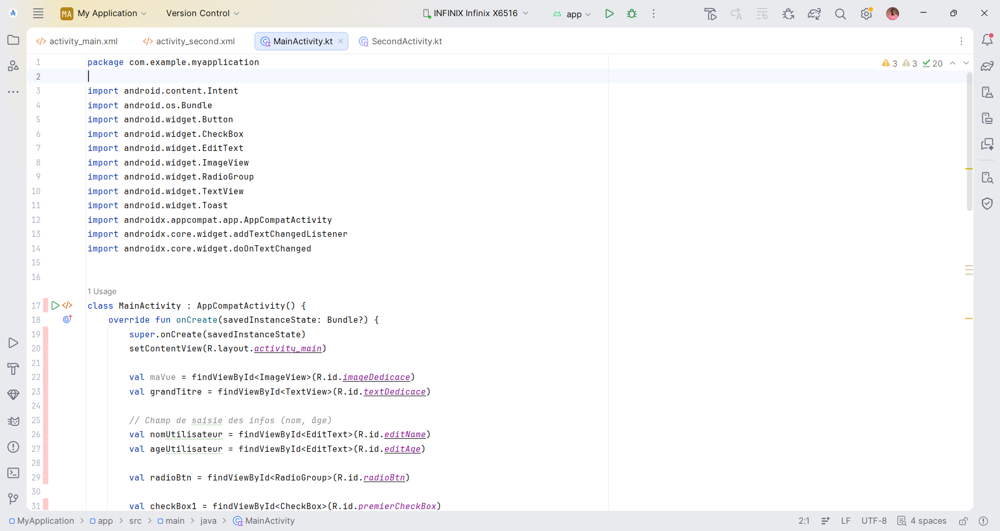
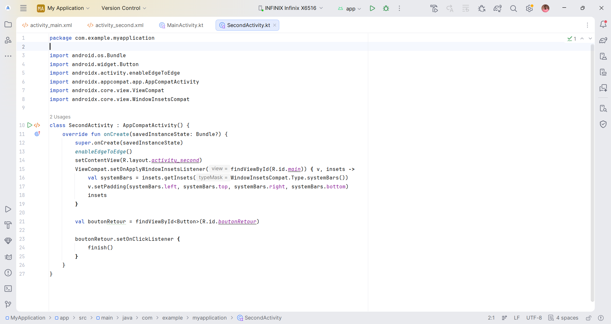
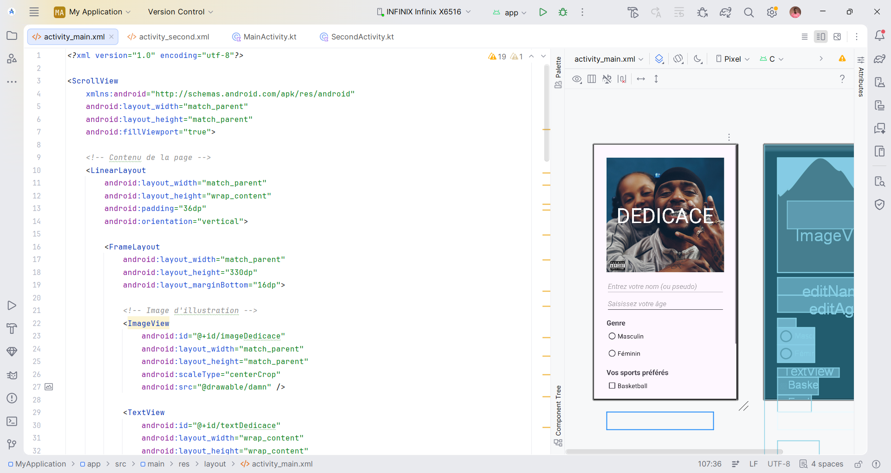
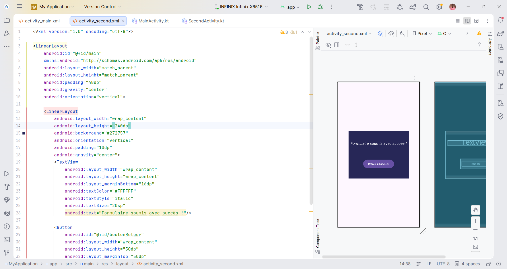

# Enquête de Préférences — App Android (v2.0)

Interface Android (Kotlin) de collecte de préférences utilisateur (nom,
âge, genre, sport favori), avec validation dynamique des champs et
navigation entre écrans.

Projet réalisé pour le Cours 12, en autodidacte.

## 🎥 Démo vidéo

[Voir la démo sur mon téléphone](https://drive.google.com/file/d/1NaBrhEbYqB8LPQMQL_89-Z3lseSCKifa/view?usp=drivesdk)

## 🚀 Fonctionnalités clés

- **Validation dynamique** : le bouton d'envoi s'active uniquement quand
  tous les champs (nom, âge, genre, sport) sont valides
- **UI réactive** : le titre sur l'image d'illustration se met à jour en
  temps réel avec le nom saisi
- **Navigation** : transition fluide vers l'écran de succès
  (`SecondActivity`) et retour à l'accueil
- **Expérience mobile** : formulaire entièrement scrollable pour éviter
  le masquage par le clavier

## 📂 Structure

- `MainActivity.kt` / `activity_main.xml` — logique de validation en
  temps réel, gestion des événements (`TextWatcher`, listeners) et
  layout principal
- `SecondActivity.kt` / `second_main.xml` — écran de confirmation de
  soumission et retour

> Extrait du projet Android Studio (fichiers clés uniquement — le projet
> complet inclut la configuration Gradle standard).

## 🖼️ Aperçu

## 🛠️ Stack

Kotlin · Android SDK · Android Studio
